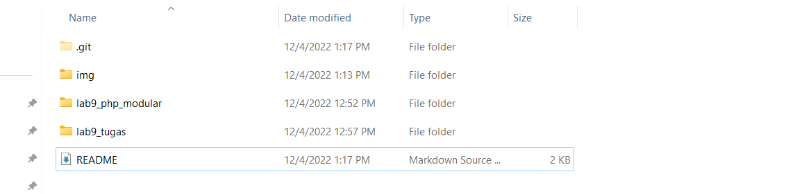
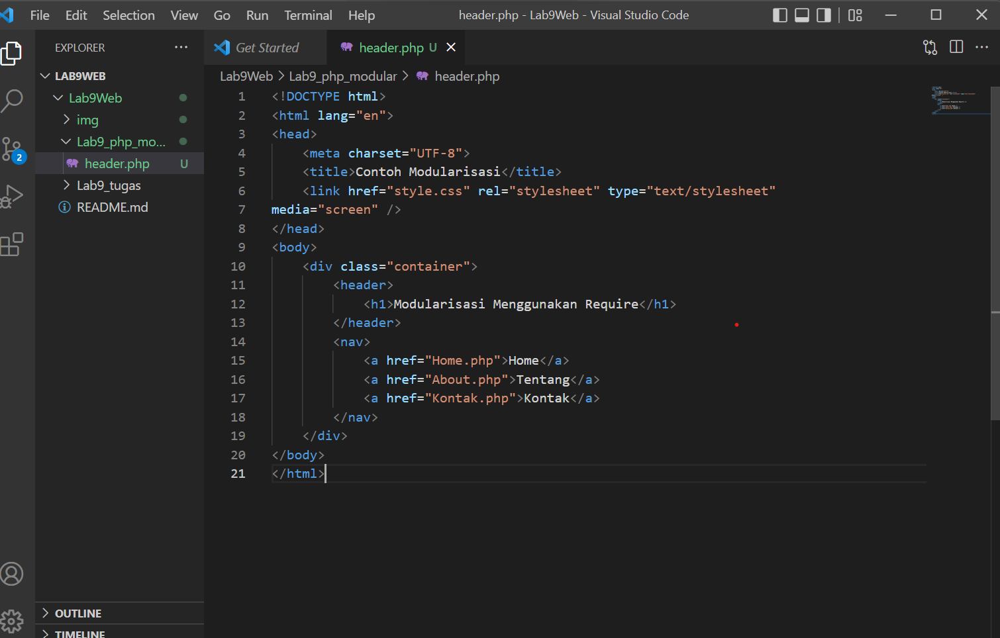
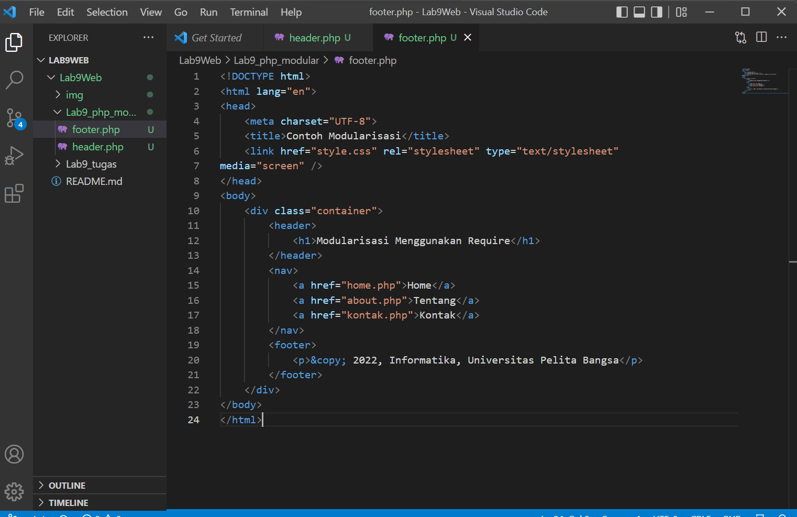
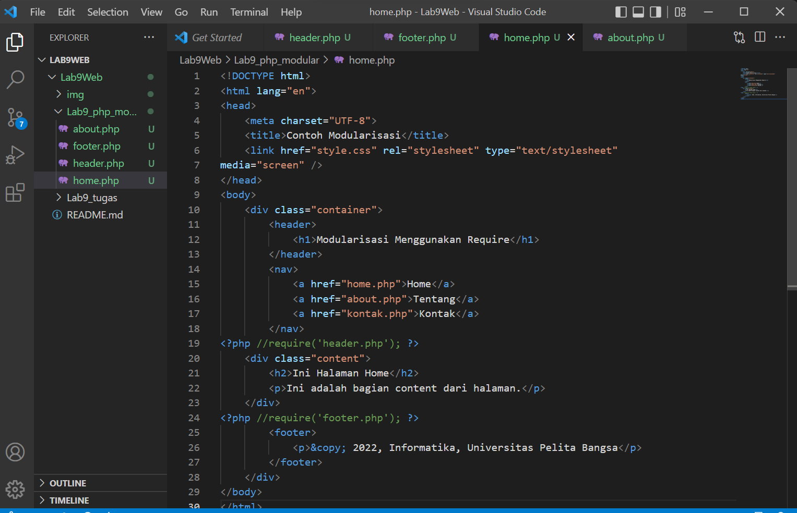
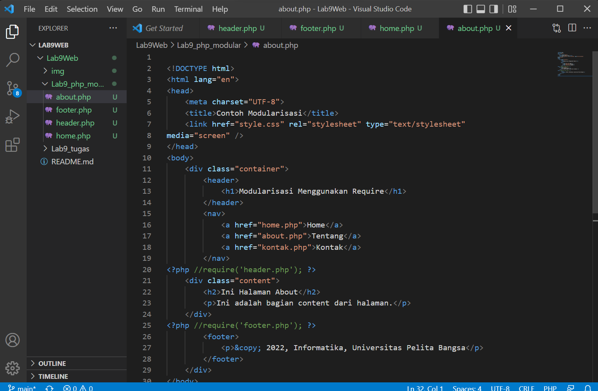
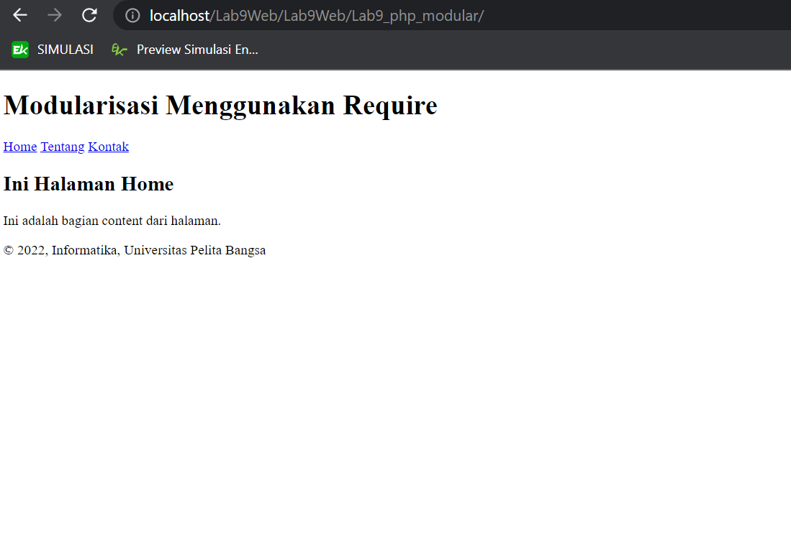
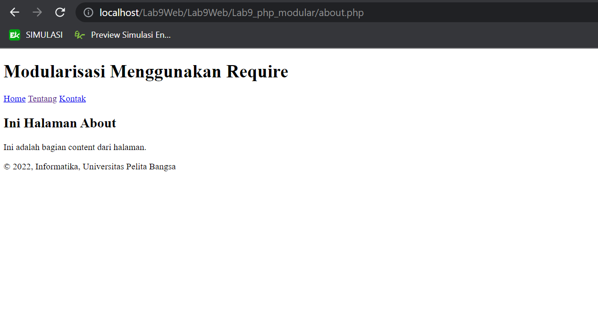
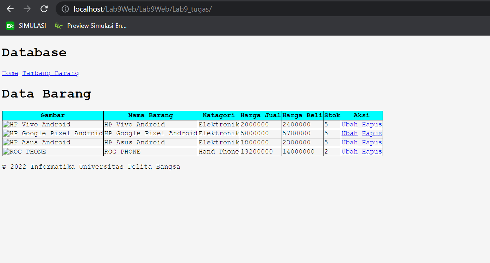
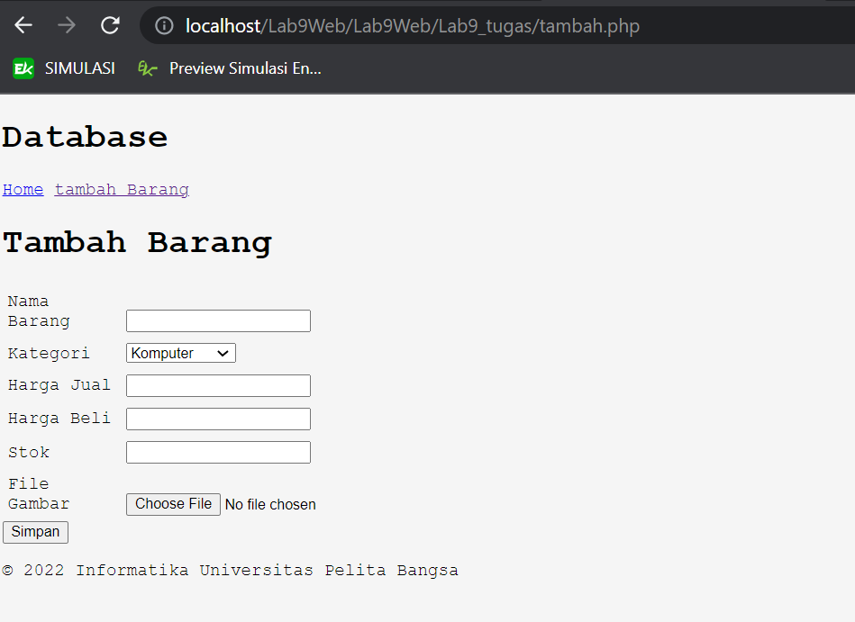
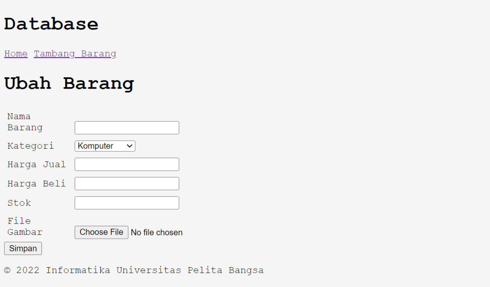

# Lab9Web
Disini saya akan membuat program modular sederhana menggunakan PHP
# Langkah - langkah Praktikum

## 1). Buat folder baru dengan nama lab9_php_modular pada docroot webserver

## 2). Buat file baru dengan nama header.php

## 3). Buat file baru dengan nama footer.php

## 4). Buat file baru dengan nama home.php

## 5). Buat file baru dengan nama about.php

## 6). Hasil tampilan halaman home pada browser dengan menggunakan modular header dan footer

## 7). Hasil tampilan halaman about pada browser dengan menggunakan modular header dan footer

----------------------------------------------------

# Pertanyaan & Tugas
Implementasikan konsep modularisasi pada kode program praktikum 8 tentang
database, sehingga setiap halamannya memiliki template tampilan yang sama.

# Hasil Run
## - Tampilan halaman home

## - Tampilan halaman tambah barang

## - Tampilan halaman ubah barang

# TERIMA KASIH# Lab9Web